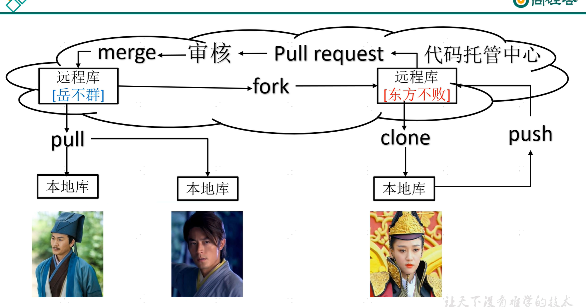

# git 教程
git视频校正参考链接[尚硅谷Git入门到精通全套教程（涵盖GitHub\Gitee码云\GitLab](https://www.bilibili.com/video/BV1vy4y1s7k6/?vd_source=2386e4b8d30b30fcaeb6b7be37797211)

## Part 1 Git 概述
Git 是一个免费的、开源的分布式版本控制工具。
版本控制最重要的是可以记录修改
集中式版本控制器：中央服务器单点故障
分布式版本控制工具：git
基本的架构形式

分布式版本控制系统出现之后，解决了集中式版本控制系统的缺陷：
1. 服务器断网的情况下也可以进行开发（因为版本控制是在本地进行的）
2. 每个客户端保存的也都是整个完整的项目（包含历史记录，更加安全）

### Git 工作机制[git工作机制](https://www.bilibili.com/video/BV1vy4y1s7k6?vd_source=2386e4b8d30b30fcaeb6b7be37797211&spm_id_from=333.788.player.switch&p=6)
git 分为本地库、暂存区、工作区，如图所示

工作区：代码存放的磁盘的位置
暂存区：将工作区的代码临时存储，暂存区的代码也是可以删除的，没有生成对应点的历史版本
本地库：将暂存区的代码提交本地库，就可以生成对应的历史版本，此时的代码不可修改

### Git和代码托管中心
代码托管中心是基于网络服务器的远程代码仓库，一般我们简单称为**远程库**。
1. 局域网
   GitLab
2. 互联网
   GitHub(外网)
   Gitee(国内网站)

实际上，在推送到本地库之后需要再推送到远程库，如图所示

### Git常用命令
Git常用命令有如图

1. **设置用户签名**
   > git config --global user.name 用户名
   > git config --global user.email 邮箱

git 首次安装必须设置一下用户签名，否则无法提交代码 

**注意**这里设置用户签名和将来登录Github（或其他代码托管中心）的账号没有任何关系。签名的作用是区分不同操作者身份。

2. **初始化本地库**
1）**基本语法**
> git init

 
执行这条指令的意思也就是在本地库路径下赋予git操作权限

查看本地库的状态
> git status

示例使用如图

图中三行提示指令意思为：
`on branch master`也就是我们安装时后默认创建的分支名字
`no commits yet` 目前没有项目需要提交
`nothing to commit (create/copy files and use "git add" to track)`

在项目内创建新文件，再次使用`git status`查看，示例如图

此时提示有`untracked files`，
然后根据提示执行`git add`，将待追踪的文件存入暂存区。

再次使用`git status`查看，示例如图

发现此时的hell.txt文件已经变为绿色，说明git可以追踪到这个文件，但是此时仍然可以删除历史版本，根据界面提示的指令`git rm --cached <file>...`删除暂存区的文件。示例如图

**注意**：此时删除的只是暂存区的文件，工作区的文件并未被删除。

3. **提交本地库**

   3.1 ***将暂存区的文件提交到本地库*
   1） 基本语法
   > git commit-m "日志信息" 文件名

   示例如图

可以使用`git reflog`查看本地库状态。示例如图

可以查看到已经上传成功。

也可以使用指令`git log`指令查看更为详细的内容，此时输出的log信息更全，包括本次commit的作者、版本、日志信息等。

修改后再次将文件再次推送到本地库中，示例如图

提交完成后，可以使用指令`git log`查看所有提交的历史。示例如图

。

4. **历史版本**
   4.1 **查看历史版本**
   1）基本语法
   `git reflog` 查看版本信息
   `git log`  查看版本详细信息

   如果打算回退到某个历史版本，可以先试用`git reflog`查看提交版本历史，查找版本号，然后使用`git reset --hard 版本号`指令进行回退。

示例如图

此时可以发现版本号的指针已经指向了第2次提交的版本。

版本切换后就可以使用指令查看版本信息。

git切换版本，底层其实是移动HEAD指针，具体原理如图所示，

## Git 分支操作

一般服务器部署的流程,示例如图

### 什么是分支

在版本控制过程中，同事推进多个任务，为每个任务，我们就可以创建每个任务的单独分支。使用分支意味着程序员可以把自己的工作从开发主线上分离开来，开发自己分支的时候不会影响主线分支的运行。对于初学者而言，分支可以简单理解为副本，一个分支就是一个单纯地副本。（分支底层其实也是指针的引用）

示例如图

### 分支的好处
同时并行推进多个功能开发，提高开发效率。
各个分支在开发过程中，如果某一个分支开发失败，不会对其他分支有任何影响，失败的分支删除重新开始即可。

### 分支的操作
`git branch 分支名`   创建分支
`git branch -v`       查看分支
`git checkout 分支名` 切换分支
`git merge 分支名`    合并分支 把指定的分支合并到当前分支上

示例如图

切换分支后可以修改、提交到本地库，示例如图

4.3 **合并分支**
首先需要切换到想要合并的分支，例如我想将hot-fix合并到master分支上，则首先需要使用`git checkout master`指令切换到master分支上，然后再使用`git merge hot-fix`指令，
示例如图

注意：这种操作时将hot-fix分支合并到master分支上。

**冲突合并**

冲突产生的原因：
合并分支时，两个分支在同一个文件的同一个位置有两套完全不同的修改、Git无法替我们决定使用哪一个。

1）必须人为决定   新代码内容。
示例如图

此时需要手动确定要保留的代码，并且删除特殊符号，然后手动保存。

2）保存后将人为修改的代码添加到暂存区。
> git add hello.txt

3）执行提交（注意：此时使用git commit 命令时不能带文件名）

示例如图

示例如图

此时可以看到master后已经没有`merging`的提示了，表示合并成功，解决了代码冲突。

注意：此时合并冲突只修改了master分支下的代码，并没有修改hot-fix分支下的代码。

示例如图

master、hot-fix其实都是指向具体版本记录的指针。当前所在的分支，其实是由`HEAD`决定的。所以创建分支的本质就是多创建一个指针。

`HEAD`如果执行master，那么我们现在就在master分支上。
`HEAD`如果执行hotfix，那么我们现在就在hotfix分支上。
所以切换分支的本质就是移动`HEAD`指针。

# 第5章 Git 团队协作机制
## 5.1 团队内协作

团队内协作，示例如图

团队内协作，示例如图

## 5.2 团队间协作
团队间协作，示例如图

# 第6章 GitHub操作
## 6.2 远程仓库操作
`git remote -v`  查看当前所有远程地址别名
`git remote add 别名 远程地址` 起别名
`git push 别名 分支` 推送本地分支上的内容到远程仓库
`git clone 远程地址` 将远程仓库的内容克隆到本地
`git pull 远程仓库地址别名 远程分支名` 将远程仓库对于分支最新内容拉下来后与当前本地分支直接合并

### 6.2.1 创建远程仓库别名
`git remote -v`  查看当前所有远程地址别名，主要原因是直接用网址的话名称太长不好记忆，因此取一个较短的别名方便记忆。

案例实操，示例如图

### 6.2.2 推送本地分支上的内容到远程仓库
1）基本语法
`git push 别名 分支`
示例如图

注意:初次提交时可能提示`no upstream branch`，需要设置，如指令`git push --set-upstream testProject master`，在远端可以切换到`master`分支下，查看发现推送成功。

### 拉取远程仓库到本地库
1）基本语法
`git pull 别名 分支` 从远端分支拉取到当前分支，注意拉取的时候需要本地分支和远端分支一致。示例如图

### 6.2.3 克隆远程仓库到本地
1）基本语法
`git clone 远程地址`
克隆代码不需要登录账号。 clone会做如下操作：1.拉取代码。2.初始化本地仓库。3.创建别名

将git配置到vscode终端
